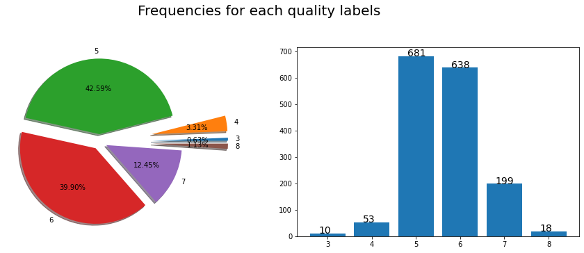
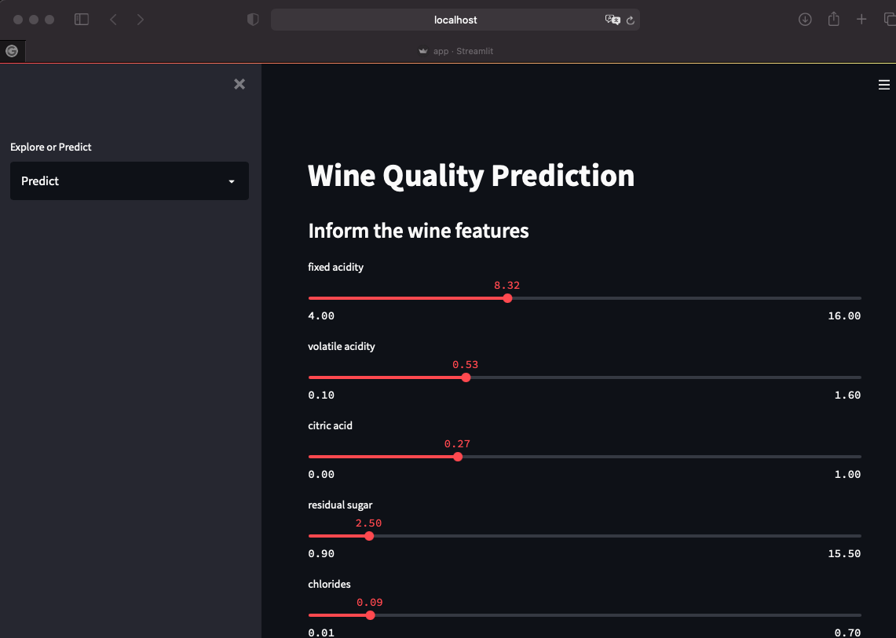

# WineQuality-ImbalancedLearning

Access the web app : https://winequalityimbalancedlearnign.herokuapp.com (Currently down)

Prediction of wine quality based on physical/chemical features, with Imbalanced Learning techniques.

The frequencies of each quality class are shown in the figure below:

As we can see, the lowest and highest classes have very small frequencies, compared to the medium qualities. This could indicate an Imbalanced Learning problem. Therefore, some special technicques were performed:
- data pre-processing (scaling)
- oversampling (SVMSMOTE)
- weighted class in Random Forest

## Run

To run the model, execute in the terminal of the root directory:

            $  streamlit run app.py

A webpage will be open in a localhost, with the web app.

## Stop

To stop: CRTL+C.
